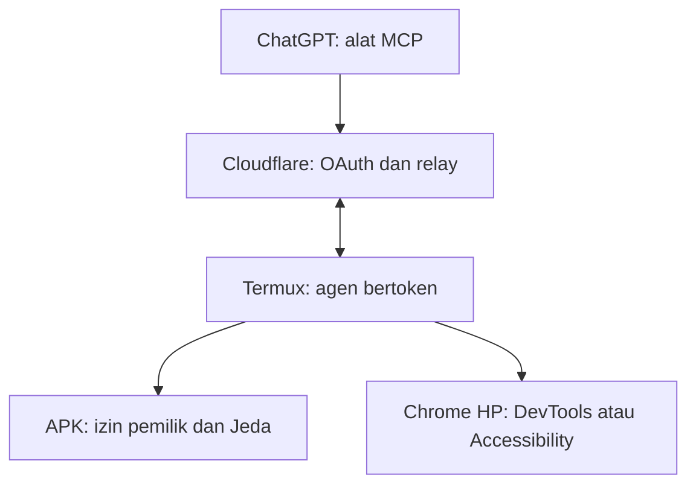

# Arsitektur dan alur perintah

Termux membuka koneksi keluar; Cloudflare tidak perlu menjangkau IP HP atau tunnel DevTools. Setiap tindakan memeriksa status APK dan izin pemilik. Dalam DevTools, agen berbicara hanya ke port 9222 lokal yang diteruskan melalui ADB yang dipasangkan pemilik. Dalam Accessibility, agen memakai API lokal APK, yang membatasi tindakan pada jendela Chrome yang terlihat.

Cloudflare menggunakan satu Durable Object untuk pemilik, token OAuth, dan socket perangkat. Perintah diserialkan dan hasil disampaikan ke client MCP. Tidak ada server browser cloud, langganan browser menit, timer 30 menit, replay perintah otomatis atau remote shell. Timeout transport, umur screenshot/ref, dan expiry OAuth tetap ada untuk mengelola keamanan serta kegagalan jaringan.

Saat koneksi putus, agen menyambung kembali dengan backoff. Aksi pending tidak diulang. Jurnal lokal menahan pengulangan ID aksi setelah restart. Pemilik dapat menjeda APK kapan saja atau mencabut token OAuth di panel.
